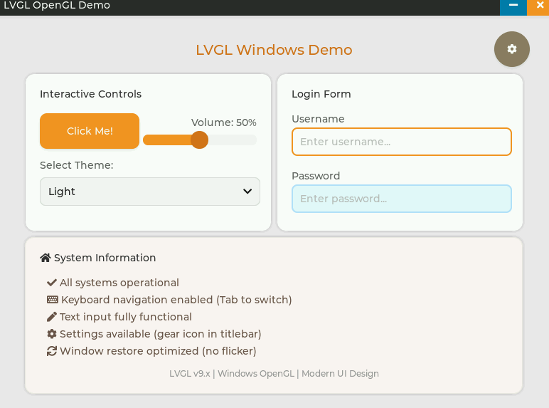

# LVGL Windows Demo

一个在 Windows 平台上运行的 LVGL 图形界面演示项目，使用 OpenGL 硬件加速渲染，具有现代化的无边框窗口设计和完整的输入支持。

## 📸 预览截图



<div align="center">
  <p><em>现代化的无边框窗口设计 | 交互式控件展示 | 登录表单示例</em></p>
</div>

## ✨ 功能特性

### 核心功能

- ✅ **OpenGL 硬件加速渲染** - 使用 OpenGL 纹理上传和 GPU 渲染，流畅显示
- ✅ **无边框现代化窗口** - 自定义标题栏，圆角窗口设计
- ✅ **完整的键盘支持** - 键盘输入、快捷键（Ctrl+A、Ctrl+C、Ctrl+V）
- ✅ **完整的鼠标支持** - 点击、拖动、滑块控制等交互
- ✅ **窗口无闪烁恢复** - 优化的窗口最小化/恢复机制
- ✅ **DPI 感知** - 自动适应高 DPI 显示器

### UI 组件展示

- 📱 **自定义标题栏** - 可拖动的深色标题栏，带关闭和最小化按钮
- 🎛️ **交互式控件卡片**
  - 按钮 - 带状态切换和颜色变化
  - 滑块 - 实时数值显示和拖动
  - 下拉框 - 主题选择菜单
- 📝 **登录表单卡片**
  - 用户名输入框 - 带聚焦状态
  - 密码输入框 - 密码遮罩模式
  - Tab 键切换焦点
- 📊 **系统信息面板** - 显示系统状态和功能说明
- ⚙️ **设置面板** - 动画速度、透明度调节

### 视觉效果

- 🎨 **现代化 UI 设计** - 卡片式布局，统一圆角风格
- 🌈 **精美配色方案** - 淡蓝标题配白色内容区
- ✨ **阴影效果** - 所有卡片带柔和阴影
- 🖼️ **抗锯齿渲染** - OpenGL 多重采样抗锯齿

## 🛠️ 技术栈

- **UI 框架**: LVGL 9.x
- **图形 API**: OpenGL 2.0+
- **平台**: Windows (Win32 API)
- **编译器**: MinGW-w64 GCC / MSVC
- **构建系统**: CMake + Ninja
- **图形库**: GDI+ (圆角窗口)

## 📋 系统要求

- **操作系统**: Windows 10 或更高版本
- **显卡**: 支持 OpenGL 2.0+ 的显卡
- **开发工具**:
  - MinGW-w64 工具链 或 MSVC
  - CMake 3.16+
  - Ninja 构建工具

## 📁 项目结构

```
LVGL_WIN/
├── main.c                  # 主程序入口
├── CMakeLists.txt          # CMake 构建配置
├── build_ninja.bat         # 快速构建脚本
├── run.bat                 # 运行脚本
├── hal/                    # 硬件抽象层
│   ├── lv_hal.c/h         # HAL 总接口
│   ├── lv_hal_disp.c/h    # 显示驱动
│   └── lv_hal_indev.c/h   # 输入设备驱动
├── platform/               # 平台相关代码
│   └── windows/
│       ├── win32_platform.c/h  # Windows 平台实现
│       └── ...
├── ui/                     # UI 组件
│   ├── maincontainer.c/h  # 主容器
│   ├── titlebar.c/h       # 标题栏
│   ├── setting.c/h        # 设置面板
│   └── custom_keys.h      # 自定义按键
├── lvgl/                   # LVGL 源码
└── build/                  # 构建输出目录
```

## 🔧 编译说明

### 方法一：使用构建脚本（推荐）

```batch
# 默认编译（无控制台窗口）
build_ninja.bat

# 调试模式（显示 printf 输出）
build_ninja.bat console

# 编译并打包成单文件（推荐发布）
build_ninja.bat pack

# 调试模式 + 打包
build_ninja.bat console pack
```

#### 构建参数说明

| 参数 | 说明 | 输出文件 |
|------|------|---------|
| *(无参数)* | 默认编译，无控制台窗口 | `build\bin\LVGL_Windows_Demo.exe` |
| `console` | 调试模式，显示 printf 输出 | `build\bin\LVGL_Windows_Demo.exe` |
| `noconsole` | 明确指定无控制台模式 | `build\bin\LVGL_Windows_Demo.exe` |
| `pack` | 编译后打包成单文件 | `build\bin\LVGL_Windows_Demo_Noconsole.exe` (单文件版本) |
| `console pack` | 调试模式 + 打包 | 两个版本都生成 |

#### 输出文件对比

- **`LVGL_Windows_Demo.exe`** (1.3 MB)
  - 普通构建输出
  - 所有 printf 输出已启用（用于调试）
  
- **`LVGL_Windows_Demo_Noconsole.exe`** (1.3 MB) - 使用 `pack` 参数生成
  - 单文件打包版本
  - 内嵌主程序并自动提取运行
  - 使用 `DETACHED_PROCESS` 确保无控制台窗口
  - **推荐用于最终发布**

### 运行程序

```batch
# 方式1: 使用运行脚本
run.bat

# 方式2: 直接运行（调试版本可能显示控制台）
.\build\bin\LVGL_Windows_Demo.exe

# 方式3: 运行打包版本（无控制台，推荐）
.\build\bin\LVGL_Windows_Demo_Noconsole.exe
```

### 方法二：手动构建

```bash
# 1. 创建构建目录
mkdir build
cd build

# 2. 配置 CMake（MinGW）
cmake -G "Ninja" -DCMAKE_BUILD_TYPE=Release ..

# 3. 编译
ninja

# 4. 运行
cd ..
.\build\bin\LVGL_Windows_Demo.exe
```

### 方法三：使用 Visual Studio

```bash
# 1. 生成 Visual Studio 解决方案
cmake -G "Visual Studio 17 2022" -A x64 -S . -B build

# 2. 打开生成的解决方案
start build\LVGL_Windows_Demo.sln
```

## 🎮 使用说明

### 调试与发布

#### 开发调试模式

```batch
# 使用 console 模式查看调试输出
build_ninja.bat console

# 运行后可以看到以下调试信息：
# ✓ LVGL initialized
# ✓ Display initialized (800x600)
# ✓ Input devices initialized (mouse + keyboard)
# ✓ HAL initialization complete
# Creating UI elements...
# Keyboard event: key=0x41 ('A'), state=1
# ...
```

#### 发布部署模式

```batch
# 生成单文件无控制台版本
build_ninja.bat pack

# 输出文件：build\bin\LVGL_Windows_Demo_Noconsole.exe
# 特点：
# - 单个 exe 文件，约 1.3 MB
# - 无控制台窗口
# - 自动提取和清理
# - 适合最终用户使用
```

### 键盘操作

- **Tab** - 在输入框之间切换焦点
- **Ctrl+C** - 复制选中文本
- **Ctrl+V** - 粘贴文本
- **Enter** - 确认输入
- **Backspace/Delete** - 删除字符
- **方向键** - 移动光标

### 鼠标操作

- **左键点击** - 选择控件、点击按钮
- **拖动标题栏** - 移动窗口
- **拖动滑块** - 调节数值
- **点击下拉框** - 展开选项

### 窗口操作

- **最小化按钮** - 最小化到任务栏
- **关闭按钮** - 退出程序
- **拖动标题栏** - 移动窗口位置

## 🏗️ 架构设计

### 模块分层

```
┌─────────────────────────────────────┐
│          Application Layer          │
│  (main.c, UI components)           │
├─────────────────────────────────────┤
│         LVGL Framework              │
│  (Widget rendering, event handling) │
├─────────────────────────────────────┤
│      Hardware Abstraction Layer     │
│  (HAL: Display + Input devices)     │
├─────────────────────────────────────┤
│         Platform Layer              │
│  (Windows API, OpenGL)              │
└─────────────────────────────────────┘
```

### 关键特性

#### 1. HAL 层设计

- **显示 HAL** (`lv_hal_disp.c/h`) - 管理 OpenGL 纹理和渲染
- **输入 HAL** (`lv_hal_indev.c/h`) - 管理鼠标和键盘输入队列
- **统一接口** (`lv_hal.c/h`) - 提供初始化和访问接口

#### 2. 平台抽象

- **Windows 平台** (`win32_platform.c/h`) - 封装 Win32 API
- **消息处理** - 统一的 Windows 消息循环
- **回调机制** - 将平台事件转换为 LVGL 事件

#### 3. UI 组件化

- **主容器** - 卡片式布局设计
- **标题栏** - 独立的标题栏组件
- **设置面板** - 可扩展的设置界面

#### 4. 调试与打包机制

- **printf 调试输出** - 所有模块都包含 printf 调试信息（已启用）
- **单文件打包** - 使用资源嵌入技术，将主程序打包成单个可执行文件
- **控制台隐藏** - 打包版本使用 `DETACHED_PROCESS` 标志确保无控制台窗口

## 🔧 开发亮点

### 1. OpenGL 集成

```c
// OpenGL 纹理上传和渲染
static void display_flush_cb(lv_display_t * disp, const lv_area_t * area, uint8_t * px_map)
{
    // RGB565 -> RGBA8888 转换
    // OpenGL 纹理子图像更新
    // 硬件加速渲染
}
```

### 2. 原生窗口拖动

```c
case WM_NCHITTEST: {
    // 检测鼠标位置
    // 标题栏区域返回 HTCAPTION
    // 启用 Windows 原生拖动
}
```

### 3. GDI+ 圆角效果

```c
// 使用 GDI+ 绘制圆角窗口
Graphics graphics(hdc);
GraphicsPath path;
// 添加圆角路径
graphics.FillPath(&brush, &path);
```

### 4. 单文件打包技术

```c
// launcher_packed.c - 资源嵌入启动器
// 1. 从资源加载嵌入的主程序
HRSRC hRes = FindResourceA(hInstance, MAKEINTRESOURCEA(IDR_MAIN_EXE), RT_RCDATA);
void* pData = LockResource(LoadResource(hInstance, hRes));

// 2. 提取到临时目录
WriteFile(hFile, pData, dwSize, &written, NULL);

// 3. 使用 DETACHED_PROCESS 启动
CreateProcessA(exePath, NULL, NULL, NULL, FALSE, 
               DETACHED_PROCESS | CREATE_NO_WINDOW, ...);

// 4. 清理临时文件
DeleteFileA(exePath);
```

### 5. 调试输出系统

```c
// 所有模块都包含 printf 调试输出
#define DEBUG_PRINTF(...) printf(__VA_ARGS__)

// 使用示例
DEBUG_PRINTF("✓ LVGL initialized\n");
DEBUG_PRINTF("Creating UI elements...\n");
DEBUG_PRINTF("Keyboard event: key=0x%X\n", key);
```

## 🐛 已知问题修复

### 已修复的问题

- ✅ **键盘输入无效** - 添加了键盘事件回调注册
- ✅ **窗口恢复闪烁** - 禁用 WM_PAINT 背景绘制，添加 WM_ERASEBKGND 处理
- ✅ **滑块无法拖动** - 修复 WM_MOUSEMOVE 消息中的按钮状态检测
- ✅ **卡片内容滚动** - 禁用卡片的 SCROLLABLE 标志
- ✅ **控制台窗口问题** - 实现单文件打包方案，使用 DETACHED_PROCESS 彻底隐藏控制台
- ✅ **圆角窗口锯齿** - 集成 DWM API (Windows 11) 和 GDI+ (Windows 7/8/10) 实现平滑圆角

### 待优化问题

- ⚠️ 最小化后可能需要点击任务栏图标恢复
- ⚠️ 高 DPI 下某些 UI 元素可能需要微调

## 🚧 开发计划

- [ ] 支持窗口大小调整
- [ ] 添加更多 LVGL 控件示例
- [ ] 优化渲染性能
- [ ] 添加主题切换功能
- [ ] 完善文档和示例代码
- [x] 实现单文件打包功能
- [x] 解决控制台窗口问题
- [x] 实现平滑圆角窗口

## 📝 更新日志

### v1.1.0 (2025-10-27)

- ✨ 新增单文件打包功能（`build_ninja.bat pack`）
- ✨ 启用所有模块的 printf 调试输出
- ✨ 实现 DWM + GDI+ 平滑圆角窗口
- 🐛 修复 MinGW 控制台窗口问题
- 🐛 优化窗口拖动区域配置
- 📝 完善构建脚本和文档

### v1.0.0 (2025-10-27)

- ✨ 初始版本发布
- ✅ 实现 OpenGL 渲染
- ✅ 完整的键盘和鼠标支持
- ✅ 现代化 UI 设计
- ✅ HAL 层架构
- ✅ 平台抽象层
- ✅ 卡片式布局

## 🤝 贡献指南

欢迎提交 Issue 和 Pull Request！

1. Fork 项目
2. 创建功能分支
3. 提交更改
4. 推送到分支
5. 创建 Pull Request

## 📄 许可证

本项目采用 **GPL-3.0**（GNU General Public License v3.0）许可证。

这意味着：

- ✅ 你可以自由使用、修改和分发本软件
- ✅ 你可以将本软件用于商业用途
- ⚠️ 任何基于本软件的衍生作品必须同样采用 GPL-3.0 许可证开源
- ⚠️ 必须保留原作者的版权声明
- ⚠️ 修改后的代码必须明确标注修改内容

详情请见 [LICENSE](LICENSE) 文件或访问 [GNU GPL v3.0](https://www.gnu.org/licenses/gpl-3.0.html)。

## 🙏 致谢

- [LVGL](https://lvgl.io/) - 轻量级图形库
- [OpenGL](https://www.opengl.org/) - 跨平台图形 API
- [MinGW-w64](https://www.mingw-w64.org/) - Windows GCC 工具链

## 📞 联系方式

- GitHub: [helong70/lvgl_win_demo](https://github.com/helong70/lvgl_win_demo)
- Issues: [提交问题](https://github.com/helong70/lvgl_win_demo/issues)

---

**⭐ 如果这个项目对你有帮助，请给它一个 Star！**
